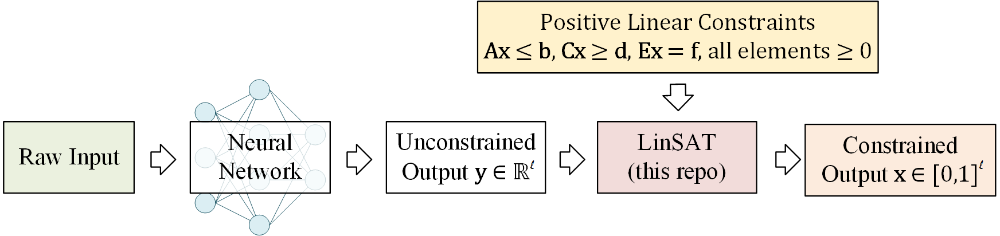

# LinSATNet
This is the official implementation of our ICML 2023 paper "LinSATNet: The Positive Linear Satisfiability Neural Networks".

* [[paper]](https://runzhong.wang/files/icml2023_LinSATNet.pdf)

With LinSATNet, you can enforce the satisfiability of general **positive linear constraints** to the output of neural networks.



The LinSAT layer is fully differentiable, and the gradients are exactly computed. Our implementation now supports PyTorch.

You can install it by

```shell
pip install linsatnet
```

And get started by

```python
from LinSATNet import linsat_layer
```

## A Quick Example

There is a quick example if you run ``LinSATNet/linsat.py`` directly. In this
example, the doubly-stochastic constraint is enforced for 3x3 variables.

To run the example, first clone the repo:
```shell
git clone https://github.com/Thinklab-SJTU/LinSATNet.git
```

Go into the repo, and run the example code:
```shell
cd LinSATNet
python LinSATNet/linsat.py
```

In this example, we try to enforce doubly-stochastic constraint to a 3x3 matrix.
The doubly-stochastic constraint means that all rows and columns of the matrix
should sum to 1.

The 3x3 matrix is flattened into a vector, and the following positive
linear constraints are considered (for Ex=f):
```python
E = torch.tensor(
    [[1, 1, 1, 0, 0, 0, 0, 0, 0],
     [0, 0, 0, 1, 1, 1, 0, 0, 0],
     [0, 0, 0, 0, 0, 0, 1, 1, 1],
     [1, 0, 0, 1, 0, 0, 1, 0, 0],
     [0, 1, 0, 0, 1, 0, 0, 1, 0],
     [0, 0, 1, 0, 0, 1, 0, 0, 1]], dtype=torch.float32
)
f = torch.tensor([1, 1, 1, 1, 1, 1], dtype=torch.float32)
```

We randomly init ``w`` and regard it as the output of some neural networks:
```python
w = torch.rand(9) # w could be the output of neural network
w = w.requires_grad_(True)
```

We also have a "ground-truth target" for the output of ``linsat_layer``, which
is an orthogonal matrix in this example:
```python
x_gt = torch.tensor(
    [1, 0, 0,
     0, 1, 0,
     0, 0, 1], dtype=torch.float32
)
```

The forward/backward passes of LinSAT follow the standard PyTorch style and are
readily integrated into existing deep learning pipelines.

The forward pass:
```python
linsat_outp = linsat_layer(w, E=E, f=f, tau=0.1, max_iter=10, dummy_val=0)
```

The backward pass:
```python
loss = ((linsat_outp - x_gt) ** 2).sum()
loss.backward()
```

We can also do gradient-based optimization over ``w`` to make the output of
``linsat_layer`` closer to ``x_gt``. This is what's happening when you train a
neural network.
```python
niters = 10
opt = torch.optim.SGD([w], lr=0.1, momentum=0.9)
for i in range(niters):
    x = linsat_layer(w, E=E, f=f, tau=0.1, max_iter=10, dummy_val=0)
    cv = torch.matmul(E, x.t()).t() - f.unsqueeze(0)
    loss = ((x - x_gt) ** 2).sum()
    loss.backward()
    opt.step()
    opt.zero_grad()
    print(f'{i}/{niters}\n'
          f'  underlying obj={torch.sum(w * x)},\n'
          f'  loss={loss},\n'
          f'  sum(constraint violation)={torch.sum(cv[cv > 0])},\n'
          f'  x={x},\n'
          f'  constraint violation={cv}')
```
And you are likely to see the loss decreasing during the gradient steps.

## API Reference

To use LinSATNet in your own project, make sure you have the package installed:
```shell
pip install linsatnet
```
and import the pacakge at the beginning of your code:
```python
from LinSATNet import linsat_layer
```

### The ``linsat_layer`` function
> linsat_layer(x, A=None, b=None, C=None, d=None, E=None, f=None, tau=0.05, max_iter=100, dummy_val=0) [[source]](https://github.com/Thinklab-SJTU/LinSATNet/blob/main/LinSATNet/linsat.py#L11)

LinSAT layer enforces positive linear constraints to the input ``x`` and
projects it with the constraints
```
A x <= b, C x >= d, E x == f
```
and all elements in ``A, b, C, d, E, f`` must be non-negative.

**Parameters:**
* ``x``: PyTorch tensor of size (``n_v``), it can optionally have a batch size (``b x n_v``)
* ``A``, ``C``, ``E``: PyTorch tensor of size (``n_c x n_v``), constraint matrix on the left hand side
* ``b``, ``d``, ``f``: PyTorch tensor of size (``n_c``), constraint vector on the right hand side
* ``tau``: (``default=0.05``) parameter to control the discreteness of the projection. Smaller value leads to more discrete (harder) results, larger value leads to more continuous (softer) results.
* ``max_iter``: (``default=100``) max number of iterations
* ``dummy_val``: (``default=0``) the value of dummy variables appended to the input vector

**return:** PyTorch tensor of size (``n_v``) or (``b x n_v``), the projected variables

Notations:
* ``b`` means the batch size.
* ``n_c`` means the number of constraints (``A``, ``C``, ``E`` may have different ``n_c``s)
* ``n_v`` means the number of variables

### Some practical notes

1. You must ensure that your input constraints have a non-empty feasible space.
Otherwise, ``linsat_layer`` will not converge.
2. You may tune the value of ``tau`` for your specific tasks. Reasonable choices
of ``tau`` may range from ``1e-4`` to ``100`` in our experience.
3. Be careful of potential numerical issues. Sometimes ``A x <= 1`` does not
work, but ``A x <= 0.999`` works.
4. The input vector ``x`` may have a batch dimension, but the constraints can
not have a batch dimension. The constraints should be consistent for all data in
one batch.

## How it works?

Here we briefly introduce the mechanism inside LinSAT. For more details and
formal proofs, please refer to [our paper](https://runzhong.wang/files/icml2023_LinSATNet.pdf).


## More Complicated Use Cases (appeared in our paper)

To be updated soon.

## Citation
If you find our paper/code useful in your research, please cite
```
@inproceedings{WangICML23,
  title={LinSATNet: The Positive Linear Satisfiability Neural Networks},
  author={Wang, Runzhong and Zhang, Yunhao and Guo, Ziao and Chen, Tianyi and Yang, Xiaokang and Yan, Junchi},
  booktitle={International Conference on Machine Learning (ICML)},
  year={2023}
}
```
